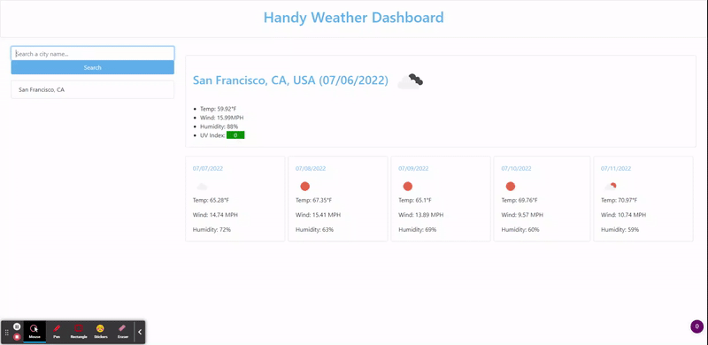

# Handy-Weather-Dashboard

## Description 

Welcome to my Handy Weather Dashboard.

This project aims to showcase my ability in utilizing Server Side APIs by presenting a weather application with dynamically updating forecast for cities input by the user.



I couldn't implement the feature to save and present user search history to and from local storage.

## Usage

In order to do this project, I used Server Side APIs such as OpenWeather's One Call API in addition to JQuery, Moment.js, Bootstrap, Javascript, HTML, CSS, git and github.

I can obtain weather data by making an API call to the `https://api.openweathermap.org/data/2.5/onecall` URL with the parameters `?lat=' + data[0].lat + '&lon=' + data[0].lon`, `&units=imperial`, and my API key `&APPID={obtain API key from openweathermap.org}'`.
```
//obtains user's input lat and lon values as parameters in URL
function displayLocation(searchQueryURL) {
    fetch(searchQueryURL)
        .then(function (response) {
            return response.json();
        })
        .then(function (data) {
            console.log(data);

            cityName = data[0].name;
            cityState = data[0].state;
            cityCountry = data[0].country;
            cityLat = data[0].lat;
            cityLon = data[0].lon;

            var queryWeatherURL = 'https://api.openweathermap.org/data/2.5/onecall?lat=' + data[0].lat + '&lon=' + data[0].lon + '&units=imperial&APPID=a6b011df2ef4ad0af87f542febbabcd1';

            getWeatherIcon(queryWeatherURL);
        })
        .catch(function (error) {
            console.error(error);
        });
}
```

## Links

[Deployed Website](https://zzzorigtbaatar.github.io/Handy-Weather-Dashboard/)

[Project Repository](https://github.com/zzzorigtbaatar/Handy-Weather-Dashboard)

## Credits

* Jerome Chenette, UC Berkeley Extension Coding BootCamp

* https://openweathermap.org/api/one-call-3


## License

[LICENSE](/LICENSE)

## Contact

https://www.linkedin.com/in/zorizulkhuu/

https://zzzorigtbaatar.github.io/My-Portfolio